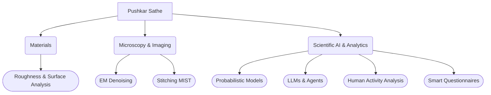

<!--Hi, I’m @pushkarsathe89

% I am interested in understanding how things work and using that to solve problems. My interests include A(G/S/?)I, Algorithms, Complex Systems, Vision, Materials, Astrobiology, Living sytems. Feel free to reach out if you share any of these interests or would like to work on something together!

%My other accounts: 
%1. https://github.com/pss2-nist
%2. https://github.com/pssNEI
%etc
-->

# 🔬 Pushkar Sathe
**Data Science | Scientific Software | Materials Analysis**

---

### 🕸️ Interactive Knowledge Map
*Click a node to search my repositories for that topic*

### 📊 Vital Signs

  
  
  

🤝 Let's Collaborate   
<!--Placeholder for autoblog or...-->

