<!--Hi, I’m @pushkarsathe89

% I am interested in understanding how things work and using that to solve problems. My interests include A(G/S/?)I, Algorithms, Complex Systems, Vision, Materials, Astrobiology, Living sytems. Feel free to reach out if you share any of these interests or would like to work on something together!

%My other accounts: 
%1. https://github.com/pss2-nist
%2. https://github.com/pssNEI
%etc
-->

# 🔬 Pushkar Sathe
**Data Science | Scientific Software | Materials Analysis**

---

### 🕸️ Interactive Repository Map:
Many repositories are private for now. but 
*Click a node to search my repositories for that topic*

```mermaid
graph TD
%% Core Nodes
    Core[Pushkar Sathe] --> Mat(Materials)
    Core --> Micro(Microscopy & Imaging)
    Core --> AI(Scientific AI & Analytics)

    %% Materials Sub-Nodes
    Mat --> Mat1([Roughness & Surface Analysis])

    %% Microscopy Sub-Nodes
    Micro --> Micro1([EM Denoising])

    %% AI & Analytics Sub-Nodes
    AI --> AI1([Probabilistic Models])
    AI --> AI2([LLMs & Agents])
    AI --> AI3([Human Activity Analysis])
    AI --> AI4([Smart Questionnaires])

%% Materials: Includes your 'taichi_mpm' fork and 'Material' repos
    click Mat "https://github.com/search?q=user%3Apushkarsathe89+fork%3Atrue+OR+user%3Ausnistgov+OR+user%3ANIH-NEI+material+OR+roughness+OR+taichi&type=repositories" "Search Materials"
    click Mat1 "https://github.com/search?q=user%3Apushkarsathe89+fork%3Atrue+roughness&type=repositories" "Search Roughness Tools"
    click Mat2 "https://github.com/search?q=user%3Apushkarsathe89+fork%3Atrue+taichi+OR+mpm&type=repositories" "Search MPM Tools"

    %% Microscopy: Includes NIST, NIH, and your 'gandissect' or 'opencv' work
    click Micro "https://github.com/search?q=user%3Apushkarsathe89+fork%3Atrue+OR+user%3Ausnistgov+OR+user%3ANIH-NEI+microscopy+OR+EM+OR+stitching+OR+opencv&type=repositories" "Search Microscopy"
    click Micro1 "https://github.com/search?q=user%3Apushkarsathe89+fork%3Atrue+denoise&type=repositories" "Search Denoising"
    
    %% AI: Includes 'prophet', 'ludwig', 'TheErdosInstitute', 'INFER-Projects'
    click AI "https://github.com/search?q=user%3Apushkarsathe89+fork%3Atrue+OR+user%3ATheErdosInstitute+OR+user%3AINFER-Projects+learning+OR+model+OR+analysis+OR+prophet+OR+ludwig&type=repositories" "Search AI Projects"
    
    %% AI Sub-nodes
    click AI1 "https://github.com/search?q=user%3Apushkarsathe89+fork%3Atrue+HMM+OR+gaussian+OR+prophet&type=repositories" "Search Probabilistic Models"
    click AI2 "https://github.com/search?q=user%3Apushkarsathe89+fork%3Atrue+prompt+OR+LLM+OR+gpt&type=repositories" "Search LLM Tools"
    click AI3 "https://github.com/search?q=user%3Apushkarsathe89+fork%3Atrue+HAA+OR+kinect+OR+activity&type=repositories" "Search HAA Projects"
    click AI4 "https://github.com/search?q=user%3Apushkarsathe89+fork%3Atrue+questionnaire+OR+active&type=repositories" "Search Questionnaires"
```

### 📊 Vital Signs

🤝 Let's Collaborate   

<!--Placeholder for autoblog or...-->

